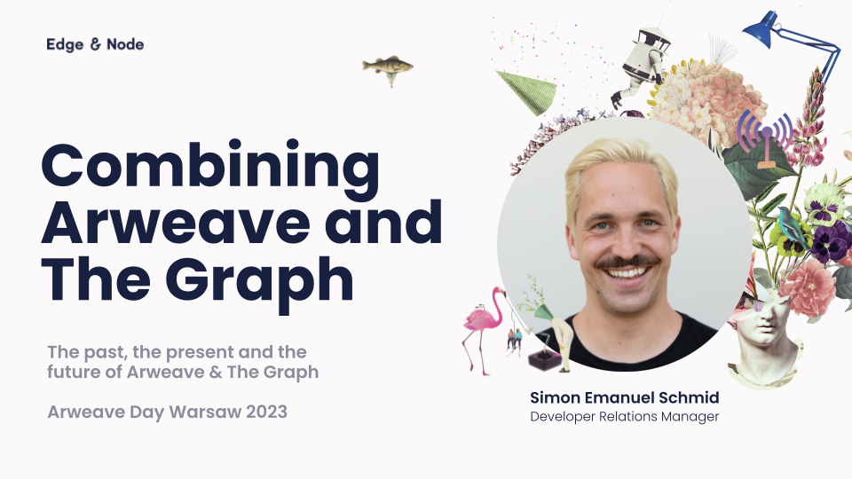

# Bundlr ❤️ Arweave ❤️ The Graph 🤩 Demo 🦩

Live Demo: https://bundlr-arweave-graph-nextjs.vercel.app

---

[Built with Scaffold ETH 2.0](https://scaffold-eth-2-docs.vercel.app/)

## Questions

https://twitter.com/schmid_si

## Slides

[](https://docs.google.com/presentation/d/1jHUaVd7A43e7DBONCTYP7QLqQH0mJiQBe59OJFsqQm8/edit?usp=sharing)

## Instructions

### 1. Create Scaffold

```bash
npx create-eth@latest
```

### 2. Integrate Bundlr

- Read the docs, anon: https://docs.bundlr.network
- Or see how I did it: [nextjs/pages/index.tsx](./packages/nextjs/pages/index.tsx)

### 3. Write the Smart Contract

- Super simple. Check it out: [contracts/BundlArweaGraNFT.sol](./packages/hardhat/contracts/BundlArweaGraNFT.sol)

### 4. Create subgraph

- https://thegraph.com/studio/
- Install Graph CLI (`yarn global add @graphprotocol/graph-cli`)

```
cd packages
graph init --studio
graph auth --studio
cd subgraph
yarn build
yarn deploy
```
